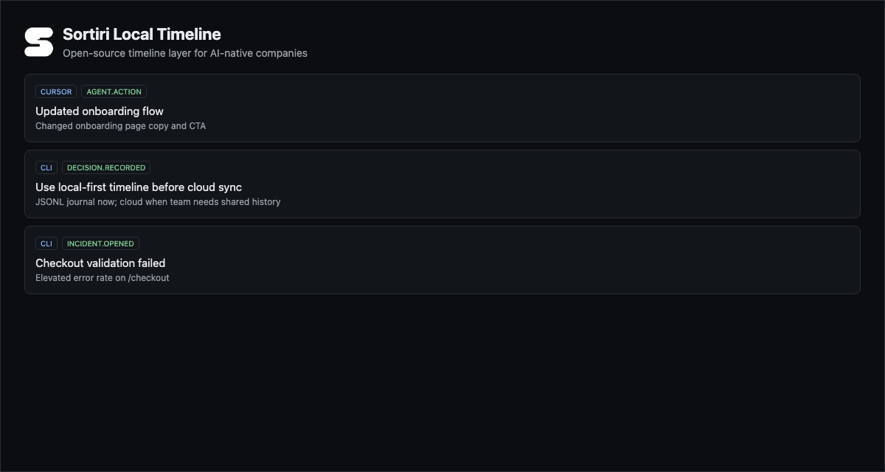

# Sortiri

Open-source timeline layer for AI-native companies.

Sortiri records agent actions, commands, diffs, decisions, incidents, rollbacks, product events, and outcomes into one replayable company timeline.

```bash
npx sortiri init
sortiri dev
```



**At a glance**

- Local-first company timeline
- CLI + MCP server
- Cursor/agent rules
- JSONL export
- Optional cloud sync later

If you are building with coding agents, star Sortiri to follow the open-source launch.

Repository: [github.com/sortiri/sortiri](https://github.com/sortiri/sortiri)

## What is Sortiri?

Sortiri is a local-first timeline layer for AI-native companies. It captures what agents did, what commands ran, what files changed, what decisions were made, and what happened when things went wrong — in one replayable company timeline.

Sortiri works with Cursor and other MCP-capable agents. Use the CLI for setup and validation, MCP tools for agent recording, and a local JSONL journal you own.

## Why AI-native companies need a timeline

AI agents change code, run commands, and make product decisions — often without a durable audit trail. When something breaks, teams ask:

- What did the agent change?
- What commands ran?
- What decision led here?
- What validation passed before deploy?

Sortiri answers those questions with a factual timeline: agent actions, command output, file diffs, decisions, incidents, rollbacks, and validation results — replayable in order.

## Quickstart

From any git repo:

```bash
npx sortiri init --yes
sortiri doctor
sortiri dev
```

This will:

1. Initialize Sortiri in local mode (no cloud account required)
2. Create `.sortiri/config.json` and `.sortiri/events.jsonl`
3. Install Cursor MCP config and agent rules
4. Record a sample system event
5. Open a local timeline viewer at `http://127.0.0.1:4317`

Record a test event:

```bash
sortiri record --type agent.action --title "Updated onboarding flow"
```

Export your timeline:

```bash
sortiri export --out timeline.jsonl
```

See [docs/quickstart.md](docs/quickstart.md) for the full walkthrough. See [docs/troubleshooting.md](docs/troubleshooting.md) if something fails.

## What gets recorded

Sortiri records meaningful work history, not every token:

| Category | Examples |
|----------|----------|
| Agent actions | Plans, tool calls, task completion |
| Commands | `sortiri run -- npm test`, build/lint output |
| Code changes | File created, changed, deleted |
| Decisions | Architecture, product, security choices with rationale |
| Incidents | Outages, deploy failures, rollbacks |
| Validation | Test/lint/typecheck pass or fail |
| Integrations | GitHub, Stripe, PostHog, Slack (cloud mode) |

Core event types: `agent.action`, `command.run`, `command.failed`, `code.changed`, `decision.recorded`, `incident.opened`, `incident.resolved`, `rollback.recorded`, `validation.passed`, `validation.failed`, `product.event`, `revenue.event`, `system.event`.

## Local-first architecture

Local mode stores everything on disk:

```txt
.sortiri/
  config.json      # mode, editor, optional cloud credentials
  session.json     # active workstream (gitignored)
  events.jsonl     # append-only timeline journal
```

- No cloud account required
- No network calls for recording in local mode
- You own the data — export anytime with `sortiri export`
- Replay with `sortiri dev` local viewer

Cloud sync is optional. See [docs/local-first.md](docs/local-first.md).

## MCP / Cursor setup

After `sortiri init`, `.cursor/mcp.json` includes:

```json
{
  "mcpServers": {
    "sortiri": {
      "command": "npx",
      "args": ["sortiri", "mcp"],
      "env": {
        "SORTIRI_CONFIG_PATH": ".sortiri/config.json"
      }
    }
  }
}
```

Restart the Sortiri MCP server in Cursor after setup.

Agent rules are written to `.cursor/rules/sortiri.mdc`. See [docs/mcp.md](docs/mcp.md) and [docs/cursor.md](docs/cursor.md).

## CLI commands

| Command | Purpose |
|---------|---------|
| `sortiri init` | Initialize local or cloud mode |
| `sortiri doctor` | Verify setup |
| `sortiri dev` | Start local timeline viewer |
| `sortiri record` | Append an event to the local journal |
| `sortiri export` | Export `events.jsonl` |
| `sortiri mcp` | Start MCP server (stdio) |
| `sortiri run -- <cmd>` | Run a command and capture output |

Cloud-only commands (context, recommendations, evals, decisions, incidents, reliability) require cloud mode. See [docs/cli.md](docs/cli.md).

## Event schema

Each line in `.sortiri/events.jsonl` is a canonical event:

```json
{
  "id": "evt_example",
  "timestamp": 1780000000000,
  "source": "cursor",
  "type": "agent.action",
  "title": "Updated onboarding flow",
  "summary": "Changed onboarding page copy and CTA",
  "project": "web",
  "workstream": "ws_example",
  "actor": { "type": "agent", "name": "Cursor Agent" },
  "metadata": {
    "files": ["src/app/onboarding/page.tsx"],
    "commands": ["npm run test"]
  }
}
```

See [docs/event-schema.md](docs/event-schema.md) for all fields and types.

## Local timeline export

Export your full local timeline:

```bash
sortiri export
sortiri export --out exported-timeline.jsonl
```

The JSONL format is portable — share it, archive it, or import into other tools. See [docs/export.md](docs/export.md).

## Optional cloud sync

Sortiri Cloud is the managed version for teams that need shared history, retention, source health, audits, RBAC, reliability, and support.

Connect with a setup token from Sortiri Cloud:

```bash
sortiri init --token <setup-token>
```

Local mode remains the default. Cloud is optional. See [docs/cloud.md](docs/cloud.md).

## Open Source vs Cloud

Sortiri open source gives you:

- CLI
- MCP server
- local timeline
- local journal
- event schema
- Cursor/agent rules
- JSONL export
- local replay

Sortiri Cloud will add:

- hosted team workspaces
- shared timelines
- managed retention
- source health
- audit evidence rooms
- redaction workflows
- RBAC
- SSO later
- reliability monitoring
- support

Licensed under Apache-2.0. SDK, CLI, MCP, and event schema are open source. Some cloud enterprise features may be proprietary later.

## Roadmap

See [ROADMAP.md](ROADMAP.md) for planned work: local-first improvements now, managed cloud upgrade path later.

## Contributing

We welcome contributions. See [CONTRIBUTING.md](CONTRIBUTING.md) and [docs/contributing.md](docs/contributing.md).

## Security

Local mode does not require sending data to Sortiri Cloud. Users control what is recorded. Do not commit secrets to `.sortiri/` or issues.

Report vulnerabilities per [SECURITY.md](SECURITY.md). See [docs/security.md](docs/security.md) for secret handling and data guidance.

## License

Apache-2.0 — see [LICENSE](LICENSE).
