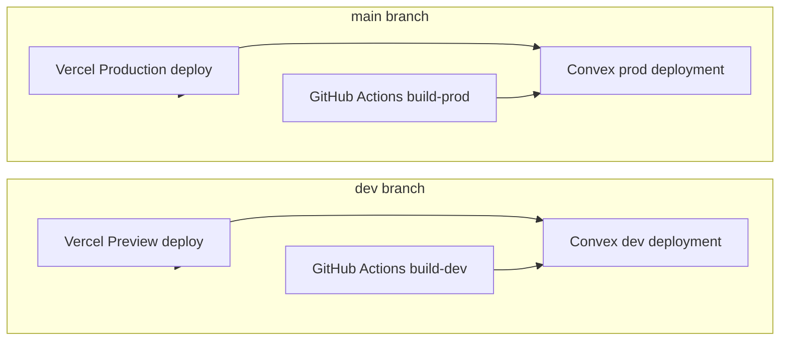

# Infrastructure setup (Vercel + GitHub + Convex + Clerk)

## Vercel project

| Setting | Value |
|---------|-------|
| Team | `claydcruzes-projects` |
| Project | `sortiri-timeline` |
| GitHub repo | `clayton-dcruze/sortiri-timeline` |
| Production branch | `main` |
| Preview branches | `dev` + PRs |
| Dashboard | https://vercel.com/claydcruzes-projects/sortiri-timeline |

Build command (from `vercel.json`):

```bash
npx convex deploy --yes --cmd 'npm run build'
```

## Environment matrix

| Variable | Local | Vercel Preview (`dev`) | Vercel Production (`main`) |
|----------|-------|------------------------|----------------------------|
| `CONVEX_DEPLOY_KEY` | — | dev deploy key | prod deploy key |
| `NEXT_PUBLIC_CONVEX_URL` | from `convex dev` | `https://reminiscent-akita-721.convex.cloud` | set by deploy |
| `NEXT_PUBLIC_CLERK_PUBLISHABLE_KEY` | `.env.local` | Clerk test key | Clerk test key |
| `CLERK_SECRET_KEY` | `.env.local` | Clerk secret | Clerk secret |
| `CLERK_JWT_ISSUER_DOMAIN` | `.env.local` | `https://growing-heron-15.clerk.accounts.dev` | same |

Clerk instance: **growing-heron-15** (shared dev keys).

## Convex deployments

See [convex-deployments.md](./convex-deployments.md).

| Target | Deployment | URL |
|--------|------------|-----|
| Dev | `reminiscent-akita-721` | https://reminiscent-akita-721.convex.cloud |
| Prod | `little-ocelot-267` | https://little-ocelot-267.convex.cloud |
| Preview (`dev` branch) | `adorable-meerkat-790` | https://adorable-meerkat-790.convex.cloud |

> **Note:** Vercel preview builds currently use the **dev deploy key** (shared dev backend). For isolated per-PR Convex backends, generate a **Preview Deploy Key** in the [Convex project settings](https://dashboard.convex.dev/t/clayton-7de15/sortiri-timeline/settings) and replace the preview `CONVEX_DEPLOY_KEY` in Vercel.

## GitHub Actions CI

Workflow: `.github/workflows/ci.yml`

| Trigger | Job | What it does |
|---------|-----|--------------|
| Push to `main` | `build-prod` | `convex deploy` + `npm run build` with prod key |
| Push to `dev` | `build-dev` | `convex deploy` + `npm run build` with dev key |
| Pull request | `build-pr` | lint + static Next.js build |
| All | `lint` | ESLint |

### GitHub secrets (configured)

- `CONVEX_DEPLOY_KEY_PROD`
- `CONVEX_DEPLOY_KEY_DEV`
- `CONVEX_DEPLOY_KEY_PREVIEW` (dev key, same as dev)
- `NEXT_PUBLIC_CLERK_PUBLISHABLE_KEY`
- `CLERK_SECRET_KEY`
- `CLERK_JWT_ISSUER_DOMAIN`
- `VERCEL_TOKEN`
- `CONVEX_ACCESS_TOKEN`

Regenerate with:

```bash
export CLERK_SECRET_KEY=...
export NEXT_PUBLIC_CLERK_PUBLISHABLE_KEY=...
export CLERK_JWT_ISSUER_DOMAIN=...
./scripts/sync-infra-secrets.sh
```

## Deploy flow


